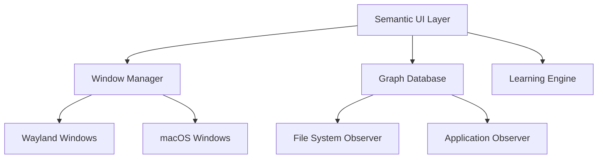

# Semantic Application Manager Integration Design
Version 1.0

## System Overview

The Semantic Application Manager (SAM) extends the Wayland/macOS compositor by adding a semantic layer for application and file management. This document describes the integration points and key architectural decisions.



## Core Components

### 1. Window Manager Integration

```zig
const ApplicationManager = struct {
    // Core state
    window_manager: *WindowManager,
    graph_db: *GraphDB,
    learning_engine: *LearningEngine,
    
    // Tracks active applications and their windows
    const AppInstance = struct {
        app_id: u64,
        windows: std.ArrayList(*Window),
        launch_time: i64,
        current_files: std.ArrayList(*FileNode),
    };
    
    active_instances: std.AutoHashMap(u64, AppInstance),
    
    pub fn launchApplication(self: *Self, app_node: *AppNode, file_node: ?*FileNode) !*AppInstance {
        // Create new instance
        var instance = try self.createAppInstance(app_node);
        
        // Launch based on app type
        switch (app_node.app_type) {
            .wayland => try self.launchWaylandApp(instance, app_node, file_node),
            .native => try self.launchNativeApp(instance, app_node, file_node),
        }
        
        // Register with learning engine
        try self.learning_engine.recordLaunch(instance, file_node);
        
        return instance;
    }
    
    pub fn handleWindowCreated(self: *Self, window: *Window) !void {
        // Associate window with app instance
        if (self.findInstanceForWindow(window)) |instance| {
            try instance.windows.append(window);
            try self.updateWindowRelationships(instance);
        }
    }
    
    pub fn handleFileOpened(self: *Self, instance: *AppInstance, file: *FileNode) !void {
        try instance.current_files.append(file);
        try self.learning_engine.recordFileAccess(instance, file);
    }
};
```

### 2. Graph Database Structure

```zig
const NodeType = enum {
    file,
    directory,
    application,
    tag,
};

const Node = struct {
    id: u64,
    node_type: NodeType,
    creation_time: i64,
    last_access: i64,
    
    // Type-specific data
    data: union {
        file: FileData,
        dir: DirData,
        app: AppData,
        tag: TagData,
    },
};

const Edge = struct {
    from: *Node,
    to: *Node,
    edge_type: EdgeType,
    weight: f32,
    creation_time: i64,
    
    // For learned relationships
    confidence: f32,
    access_count: u32,
};

const GraphDB = struct {
    nodes: std.ArrayList(*Node),
    edges: std.ArrayList(*Edge),
    
    pub fn addLearningEdge(self: *Self, from: *Node, to: *Node, weight: f32) !void {
        const edge = try self.createEdge(.{
            .from = from,
            .to = to,
            .edge_type = .learned,
            .weight = weight,
            .confidence = 0.1, // Initial confidence
        });
        
        try self.edges.append(edge);
    }
    
    pub fn updateEdgeWeight(self: *Self, edge: *Edge, new_interaction: f32) !void {
        // Exponential moving average
        edge.weight = edge.weight * 0.9 + new_interaction * 0.1;
        edge.access_count += 1;
        edge.confidence = @min(1.0, @intToFloat(f32, edge.access_count) / 100.0);
    }
};
```

### 3. Learning Engine

```zig
const LearningEngine = struct {
    graph_db: *GraphDB,
    
    const Interaction = struct {
        app: *AppNode,
        file: *FileNode,
        duration: i64,
        action_type: ActionType,
    };
    
    pub fn recordInteraction(self: *Self, interaction: Interaction) !void {
        // Update or create relationship edge
        if (self.findEdge(interaction.app, interaction.file)) |edge| {
            try self.updateRelationship(edge, interaction);
        } else {
            try self.createRelationship(interaction);
        }
        
        // Update tag relationships
        try self.updateTagRelationships(interaction);
    }
    
    pub fn getRecommendations(self: *Self, context: *Context) ![]Recommendation {
        // Generate recommendations based on current context
        var recommendations = std.ArrayList(Recommendation).init(self.allocator);
        
        // Consider:
        // - File type
        // - Current tags
        // - Time of day
        // - Recent activity
        // - Edge weights and confidence scores
        
        return recommendations.toOwnedSlice();
    }
};
```

### 4. UI Component Integration

```swift
class SemanticUIController {
    private let graphDB: GraphDatabase
    private let windowManager: WindowManager
    private let learningEngine: LearningEngine
    
    // Main UI components
    private let tagGraphView: TagGraphView
    private let applicationListView: ApplicationListView
    private let recommendationsView: RecommendationsView
    
    func updateTagGraph() {
        // Get current context
        let context = getCurrentContext()
        
        // Update visual weights
        tagGraphView.updateWeights(for: context)
        
        // Update colors based on learned relationships
        tagGraphView.updateColors(
            using: learningEngine.getRelationships(for: context)
        )
    }
    
    func handleNodeSelection(_ node: Node) {
        // Update recommendations
        let recommendations = learningEngine.getRecommendations(
            forNode: node,
            inContext: getCurrentContext()
        )
        
        recommendationsView.update(with: recommendations)
        
        // Update application list if needed
        if node.type == .file {
            applicationListView.highlight(recommendedApps: recommendations.apps)
        }
    }
}
```

## Key Design Decisions

1. **Graph Structure**
   - Nodes represent files, applications, and tags
   - Edges represent relationships and learned patterns
   - Edge weights reflect usage patterns
   - Confidence scores separate from weights

2. **Learning System**
   - Continuous learning from user interactions
   - Exponential moving average for weight updates
   - Confidence scores increase with usage
   - Context-aware recommendations

3. **UI Integration**
   - Color coding for learned relationships
   - Visual weight representation
   - Immediate feedback for interactions
   - Context-sensitive recommendations

4. **Window Management**
   - Seamless handling of both app types
   - Relationship tracking per window
   - File association learning
   - Context preservation

## Critical Considerations

1. **Performance**
   - Graph operations must be non-blocking
   - UI updates should be throttled
   - Lazy loading of graph sections
   - Efficient edge traversal

2. **Memory Management**
   - Clear ownership boundaries
   - Proper cleanup of temporary relationships
   - Cache management for frequently accessed nodes
   - Memory limits for learning data

3. **Extensibility**
   - Plugin system for new relationship types
   - Custom tag generators
   - Alternative UI views
   - Custom learning algorithms

4. **Error Handling**
   - Graceful degradation of recommendations
   - Backup of learned relationships
   - Recovery from corrupted graph state
   - Handling of missing applications

## Future Considerations

1. **Multi-User Support**
   - Per-user graph databases
   - Shared learning patterns
   - Privacy boundaries

2. **Cloud Integration**
   - Graph synchronization
   - Shared learning across devices
   - Backup of learned relationships

3. **Advanced Learning**
   - Time-based patterns
   - Workflow detection
   - Context-aware launching
   - Pattern prediction

4. **Security**
   - Application sandboxing
   - Graph database encryption
   - Secure relationship storage
   - Access control for learned data

## Implementation Notes

Remember:
- Start with basic tag support ("app" tag only)
- Build flexible edge system for future expansion
- Focus on stable window management first
- Add learning features incrementally
- Keep UI responsive regardless of graph size
- Test with both Wayland and native apps extensively
- Monitor memory usage of graph database
- Implement proper cleanup for terminated applications