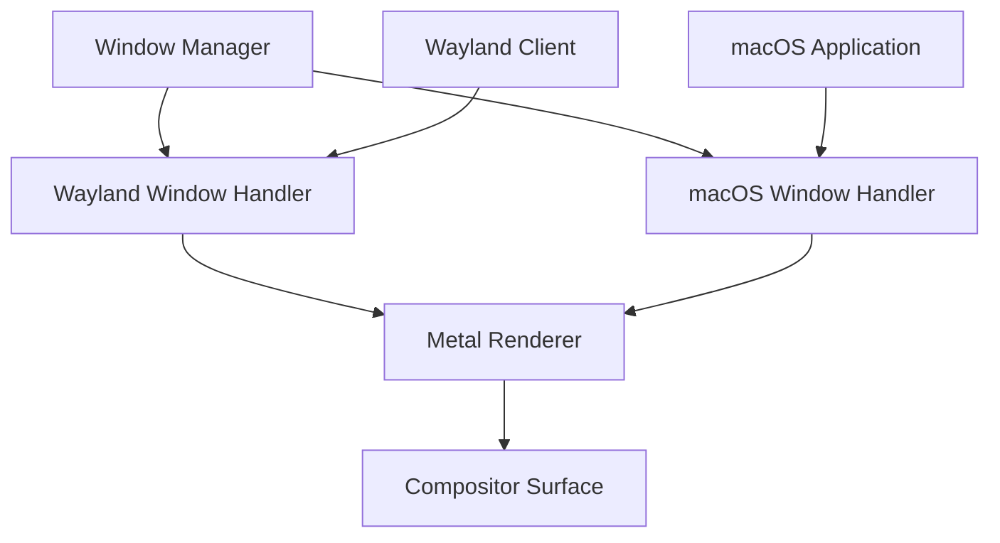

# Unified Window Management System

## Architecture Overview



## Core Components

### 1. Abstract Window Interface
```zig
const WindowType = enum {
    wayland,
    macos,
};

const Window = struct {
    // Common window properties
    id: u64,
    title: []const u8,
    x: i32,
    y: i32,
    width: i32,
    height: i32,
    minimized: bool,
    maximized: bool,
    fullscreen: bool,
    
    // Type-specific data
    window_type: WindowType,
    impl: union {
        wayland: *WaylandWindow,
        macos: *MacOSWindow,
    },
    
    // Common window operations
    pub fn move(self: *Self, x: i32, y: i32) !void {
        switch (self.window_type) {
            .wayland => try self.impl.wayland.move(x, y),
            .macos => try self.impl.macos.move(x, y),
        }
    }
    
    pub fn resize(self: *Self, width: i32, height: i32) !void {
        switch (self.window_type) {
            .wayland => try self.impl.wayland.resize(width, height),
            .macos => try self.impl.macos.resize(width, height),
        }
    }
};
```

### 2. Native macOS Integration
```swift
import AppKit

class NativeWindowManager {
    private var windowObserver: NSWindowObserver
    private var applicationObserver: NSWorkspaceObserver
    
    func startObserving() {
        // Observe window creation/destruction
        NSWorkspace.shared.notificationCenter.addObserver(
            self,
            selector: #selector(handleWindowCreated),
            name: NSWindow.didCreateNotification,
            object: nil
        )
        
        // Observe application launches
        NSWorkspace.shared.notificationCenter.addObserver(
            self,
            selector: #selector(handleAppLaunched),
            name: NSWorkspace.didLaunchApplicationNotification,
            object: nil
        )
    }
    
    @objc private func handleWindowCreated(_ notification: Notification) {
        guard let window = notification.object as? NSWindow else { return }
        // Create unified window representation
        createUnifiedWindow(from: window)
    }
    
    private func createUnifiedWindow(from nsWindow: NSWindow) {
        // Bridge native window to our unified system
        let unifiedWindow = UnifiedWindow(
            type: .macos,
            nativeWindow: nsWindow,
            delegate: self
        )
        windowManager.registerWindow(unifiedWindow)
    }
}
```

### 3. Window Management Protocol
```zig
const WindowManager = struct {
    windows: std.ArrayList(*Window),
    focused_window: ?*Window,
    
    pub fn init(allocator: std.mem.Allocator) !*WindowManager {
        // Initialize window manager
    }
    
    pub fn registerWindow(self: *Self, window: *Window) !void {
        try self.windows.append(window);
        try self.updateWindowStack();
    }
    
    pub fn unregisterWindow(self: *Self, window: *Window) !void {
        // Remove window and update stacking
    }
    
    pub fn updateWindowStack(self: *Self) !void {
        // Update z-order and compositing
    }
    
    pub fn handleInput(self: *Self, event: *InputEvent) !void {
        // Route input to appropriate window
        if (self.focused_window) |window| {
            try window.handleInput(event);
        }
    }
};
```

### 4. Unified Compositor Surface
```swift
class CompositorSurface {
    private let metalLayer: CAMetalLayer
    private var waylandSurfaces: [WaylandSurface]
    private var macOSSurfaces: [MacOSSurface]
    
    func updateSurface() {
        // Create Metal command buffer
        guard let commandBuffer = commandQueue.makeCommandBuffer() else { return }
        
        // Render Wayland windows
        for surface in waylandSurfaces {
            surface.render(to: commandBuffer)
        }
        
        // Render macOS windows
        for surface in macOSSurfaces {
            surface.render(to: commandBuffer)
        }
        
        // Present
        commandBuffer.present(drawable)
        commandBuffer.commit()
    }
}
```

## Implementation Strategy

1. Create abstraction layer for window operations
2. Implement macOS window capture and management
3. Unify input handling system
4. Extend compositor surface for mixed rendering
5. Add window transition effects
6. Implement shared clipboard

## Challenges and Solutions

1. **Z-Order Management**
   - Maintain single z-order list for all windows
   - Handle system-level window ordering
   - Implement proper focus handling

2. **Input Routing**
   - Create unified input event system
   - Route events based on window type
   - Handle global shortcuts

3. **Performance**
   - Optimize capture of macOS windows
   - Minimize copying between buffers
   - Use shared memory where possible

4. **Window Decorations**
   - Consistent appearance across window types
   - Proper scaling and DPI handling
   - Theme integration