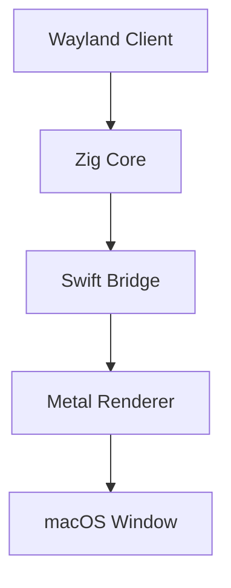

# Development Guide

## Architecture Overview

The compositor consists of three main components:

1. Zig Core (Wayland Protocol Implementation)
2. Swift Bridge (macOS/Metal Integration)
3. Metal Renderer (Graphics Pipeline)



## Building for Development

1. Enable debug mode:
```bash
zig build -Doptimize=Debug
```

2. Run with debug output:
```bash
WAYLAND_DEBUG=1 zig build run
```

## Adding New Protocols

1. Create protocol implementation:

```zig
const MyProtocol = struct {
    // Protocol implementation
};
```

2. Register with compositor:

```zig
pub fn registerProtocol(compositor: *Compositor) !void {
    // Registration code
}
```

## Testing

Run the test suite:
```bash
zig build test
```
