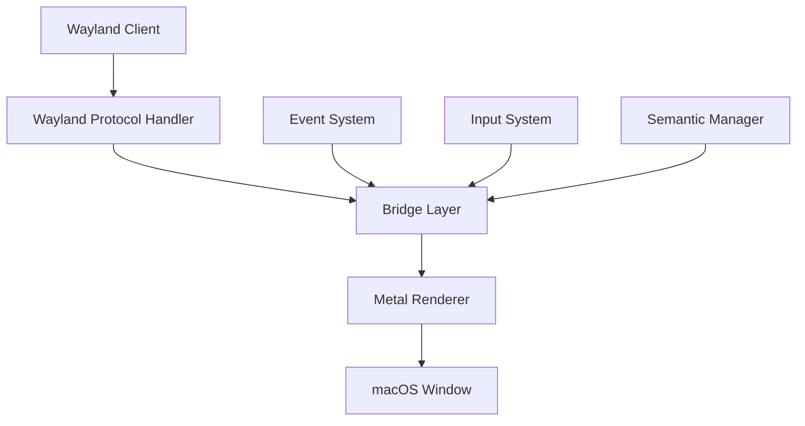

# Wayland to macOS Bridge System
Version 1.0 - Comprehensive Reference Document

## System Overview

This system bridges Wayland clients to macOS native windows through a custom compositor implementation. It consists of three main layers:

1. Wayland Protocol Layer (Zig)
2. Bridge/Translation Layer (Zig/Swift)
3. macOS Rendering Layer (Swift/Metal)



## Core Components Breakdown

### 1. Wayland Protocol Handler (Zig)

```zig
pub const WaylandServer = struct {
    display: *wl.wl_display,
    event_loop: *wl.wl_event_loop,
    compositor: *wl.wl_compositor,
    
    // Protocol support
    xdg_shell: *XdgShell,
    seat: *wl.wl_seat,
    output: *wl.wl_output,
    
    // Client tracking
    clients: std.ArrayList(*Client),
    surfaces: std.ArrayList(*Surface),

    pub fn init(allocator: std.mem.Allocator) !*WaylandServer {
        const self = try allocator.create(WaylandServer);
        
        self.display = wl.wl_display_create() orelse 
            return error.DisplayCreateFailed;
            
        self.event_loop = wl.wl_display_get_event_loop(self.display) orelse
            return error.EventLoopCreateFailed;
            
        // Initialize core protocols
        try self.initCoreProtocols();
        
        return self;
    }

    fn initCoreProtocols(self: *Self) !void {
        // Initialize base protocols
        try self.initCompositor();
        try self.initXdgShell();
        try self.initSeat();
        try self.initOutput();
    }

    pub fn run(self: *Self) !void {
        _ = try self.addSocketAuto();
        _ = wl.wl_display_run(self.display);
    }
};
```

### 2. Surface Management

```zig
pub const Surface = struct {
    // Core properties
    id: u64,
    x: i32,
    y: i32,
    width: i32,
    height: i32,
    
    // Buffer management
    current_buffer: ?*Buffer,
    pending_buffer: ?*Buffer,
    
    // Damage tracking
    damage: DamageTracker,
    
    // Metal integration
    metal_texture: ?*MetalTexture,
    
    pub fn commit(self: *Self) !void {
        // Handle buffer swap
        if (self.pending_buffer) |buffer| {
            if (self.current_buffer) |current| {
                current.release();
            }
            self.current_buffer = buffer;
            self.pending_buffer = null;
            
            // Update Metal texture
            try self.updateMetalTexture();
        }
        
        // Apply pending state
        try self.applyPendingState();
        
        // Signal for redraw
        try self.requestRedraw();
    }
    
    pub fn attach(self: *Self, buffer: ?*Buffer, x: i32, y: i32) !void {
        self.pending_buffer = buffer;
        self.pending_position = .{ .x = x, .y = y };
    }
};
```

### 3. Metal Renderer (Swift)

```swift
class MetalRenderer {
    private let device: MTLDevice
    private let commandQueue: MTLCommandQueue
    private let library: MTLLibrary
    private var renderPipeline: MTLRenderPipelineState
    
    private var surfaces: [UInt64: SurfaceRenderer]
    
    func render() {
        guard let commandBuffer = commandQueue.makeCommandBuffer(),
              let descriptor = view.currentRenderPassDescriptor,
              let encoder = commandBuffer.makeRenderCommandEncoder(descriptor: descriptor) else {
            return
        }
        
        // Set render state
        encoder.setRenderPipelineState(renderPipeline)
        
        // Render each surface
        for surface in surfaces.values {
            surface.render(encoder)
        }
        
        encoder.endEncoding()
        
        if let drawable = view.currentDrawable {
            commandBuffer.present(drawable)
        }
        
        commandBuffer.commit()
    }
}
```

### 4. Bridge Layer

```zig
pub const Bridge = struct {
    wayland_server: *WaylandServer,
    metal_renderer: *MetalRenderer,
    event_handler: *EventHandler,
    
    pub fn handleSurfaceCommit(self: *Self, surface: *Surface) !void {
        // Create or update Metal texture
        const texture = try self.metal_renderer.createTextureForSurface(surface);
        
        // Copy buffer data
        try self.copyBufferToTexture(surface.current_buffer, texture);
        
        // Update surface metadata
        try self.updateSurfaceState(surface);
        
        // Request redraw
        try self.metal_renderer.requestRedraw();
    }
    
    pub fn handleInput(self: *Self, event: *InputEvent) !void {
        // Transform coordinates
        const transformed_event = try self.transformInput(event);
        
        // Route to appropriate surface
        if (self.findTargetSurface(transformed_event)) |surface| {
            try surface.handleInput(transformed_event);
        }
    }
};
```

## Key Subsystems

### 1. Input Handling

```zig
pub const InputSystem = struct {
    const Event = union(enum) {
        mouse: MouseEvent,
        keyboard: KeyboardEvent,
        touch: TouchEvent,
    };
    
    seat: *wl.wl_seat,
    devices: std.ArrayList(*InputDevice),
    
    pub fn handleOSEvent(self: *Self, event: *NSEvent) !void {
        // Convert macOS event to our format
        const input_event = try self.convertOSEvent(event);
        
        // Transform coordinates if needed
        const transformed = try self.transformEventCoordinates(input_event);
        
        // Route to appropriate Wayland client
        try self.routeEvent(transformed);
    }
};
```

### 2. Window Management

```zig
pub const WindowManager = struct {
    windows: std.ArrayList(*Window),
    focused_window: ?*Window,
    
    pub fn createWindow(self: *Self, surface: *Surface) !*Window {
        const window = try self.allocator.create(Window);
        
        // Initialize window
        try window.init(surface);
        
        // Create macOS window
        try window.createNativeWindow();
        
        // Add to management
        try self.windows.append(window);
        
        return window;
    }
};
```

## Critical Implementation Details

### 1. Buffer Management

- Double buffering system for smooth updates
- Direct Metal texture mapping where possible
- Shared memory handling for Wayland buffers
- Damage tracking for partial updates

### 2. Coordinate Systems

- Wayland: Origin at top-left, pixels
- macOS: Origin at bottom-left, points
- Scale factor handling for Retina displays
- Transform matrices for coordinate conversion

### 3. Event Translation

- Input event coordinate transformation
- Keyboard mapping (X11 to macOS)
- Touch event synthesis
- Gesture recognition

### 4. Performance Considerations

- Direct texture access when possible
- Minimal buffer copying
- Batch rendering
- Event coalescing
- Memory pooling

## Extension Points

### 1. Protocol Extensions

```zig
pub fn registerProtocol(server: *WaylandServer, protocol: *Protocol) !void {
    // Register new protocol
    try server.protocols.append(protocol);
    
    // Initialize global
    _ = try wl.wl_global_create(
        server.display,
        protocol.interface,
        protocol.version,
        protocol,
        protocol.bind,
    );
}
```

### 2. Custom Renderers

```swift
protocol CustomRenderer {
    func initialize(device: MTLDevice)
    func render(encoder: MTLRenderCommandEncoder)
    func cleanup()
}
```

## Error Handling

```zig
pub const BridgeError = error{
    ProtocolError,
    RenderError,
    ResourceError,
    SystemError,
    
    pub fn handle(err: BridgeError) !void {
        switch (err) {
            .ProtocolError => try handleProtocolError(),
            .RenderError => try handleRenderError(),
            .ResourceError => try handleResourceError(),
            .SystemError => try handleSystemError(),
        }
    }
};
```

## Configuration System

```zig
pub const Config = struct {
    // Display settings
    vsync: bool = true,
    scale_factor: f32 = 1.0,
    
    // Performance settings
    max_fps: u32 = 60,
    buffer_pool_size: usize = 32,
    
    // Debug settings
    enable_logging: bool = false,
    trace_events: bool = false,
};
```

## Startup Sequence

1. Initialize Wayland server
2. Create Metal device and command queue
3. Set up bridge layer
4. Initialize window manager
5. Start event loop
6. Begin accepting clients

## Shutdown Sequence

1. Stop accepting new clients
2. Notify existing clients
3. Release Metal resources
4. Close Wayland connections
5. Clean up bridge resources
6. Release window manager
7. Final cleanup

## Testing Considerations

- Protocol compliance tests
- Performance benchmarks
- Resource leak detection
- Graphics correctness tests
- Input latency measurements

## Future Considerations

1. **Performance Optimizations**
   - Zero-copy texture sharing
   - Hardware cursor support
   - Event batching
   - Predictive rendering

2. **Feature Extensions**
   - Additional Wayland protocols
   - Multi-GPU support
   - HDR content
   - VRR support

3. **Reliability**
   - Client crash recovery
   - Resource cleanup
   - Error recovery
   - State restoration

## Implementation Notes

Remember:
- All buffer operations must be thread-safe
- Handle Retina display scaling correctly
- Monitor resource usage
- Implement proper cleanup
- Keep error handling consistent
- Document protocol extensions
- Test with various client types
- Profile memory usage regularly